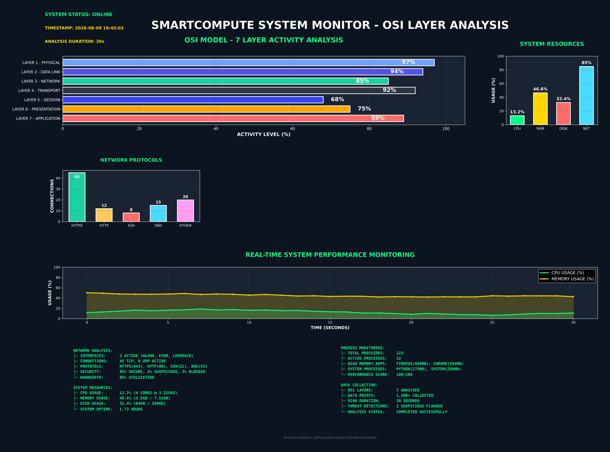

# SmartCompute

Toolkit open source para **monitoreo de host** y **análisis de protocolos
industriales (OT/ICS)**, escrito en Python. Reúne introspección del sistema
vía `psutil`, análisis de tráfico/conexiones por capa OSI, generación de
reportes HTML y una API/CLI, más un conjunto inicial de **parsers de
protocolos industriales**.

> **Honestidad sobre el estado:** hoy SmartCompute hace introspección del
> host (procesos/conexiones/recursos del propio sistema) y decodificación de
> payloads de protocolo. **Todavía no** hace captura pasiva de red ni
> "detección semántica" — eso es la dirección del proyecto, no una capacidad
> actual. Ver [Roadmap](#roadmap).

Licencia: **MIT** (ver [LICENSE](LICENSE)).

---

## Qué hace hoy

- **Monitoreo de host (`psutil`):** procesos, conexiones de red del sistema,
  uso de CPU/memoria/disco, interfaces de red. Es introspección del propio
  host, no escucha de tráfico de terceros.
- **Análisis por capa OSI:** clasificación de la actividad de red observable
  por el sistema operativo, organizada por capa.
- **Reportes HTML:** generación de reportes a partir de los datos recolectados.
- **API REST (FastAPI):** endpoints de estado del sistema y escaneo de host.
- **CLI:** comandos para escanear, monitorear, reportar y levantar la API.
- **Parsers de protocolos industriales (inicial):** funciones de
  decodificación de payloads para varios protocolos OT (ver
  [Protocolos industriales](#protocolos-industriales)).
- **Integraciones SIEM:** reenvío de eventos a Splunk (HEC) y Wazuh
  (JSON sobre syslog), con formateador CEF genérico (ver
  [Integraciones SIEM](#integraciones-siem)).

## Qué NO hace todavía

- **No** captura tráfico de red de forma pasiva (port-mirror / SPAN / PCAP).
- **No** hace detección semántica ni correlación de eventos sobre tráfico
  capturado.
- El dashboard gráfico (`core/dashboard.py`) requiere el extra opcional
  `viz` (matplotlib); no es parte del core liviano.
- El motor de protocolos contiene aún andamiaje de servidor/simulación que se
  está refactorizando hacia el uso de los parsers sobre tráfico real
  (ver [Estado del motor de protocolos](#estado-del-motor-de-protocolos)).

---

## Instalación

Requiere Python ≥ 3.9.

### Core liviano (por defecto — 6 dependencias)

```bash
pip install -r requirements-core.txt
```

Instala únicamente: `psutil`, `netifaces`, `cryptography`, `numpy`,
`fastapi`, `requests`. Suficiente para el monitoreo de host, el análisis OSI,
los reportes, la API y los parsers de protocolo.

> El servidor de la API (`serve`) necesita además `uvicorn` — ver el extra
> `serve` abajo.

### Instalación completa (todo de una vez)

```bash
pip install "smartcompute[full]"
```

Instala el core más todos los extras funcionales: dashboard gráfico,
servidor de la API, captura/IO de buses industriales e integraciones SIEM.

### Extras opcionales

Si instalaste el paquete (`pip install smartcompute`), usá los extras:

| Extra | Instalación | Qué agrega |
|---|---|---|
| `serve` | `pip install "smartcompute[serve]"` (o `pip install "uvicorn[standard]"`) | `uvicorn`, para levantar la API con `serve`. |
| `viz` | `pip install "smartcompute[viz]"` (o `pip install matplotlib`) | Habilita `core/dashboard.py` (gráficos del dashboard). |
| `industrial` | `pip install "smartcompute[industrial]"` (o `pip install scapy python-can`) | Captura/IO de buses (CAN real, etc.); base sobre la que se construirá la captura pasiva. |
| `siem` | `pip install "smartcompute[siem]"` (o `pip install PyYAML`) | Lectura del `siem_config.yaml` para las [integraciones SIEM](#integraciones-siem). |
| `full` | `pip install "smartcompute[full]"` | **Todo lo anterior en un solo paso** (`viz` + `serve` + `industrial` + `siem`). |

---

## Uso

### CLI

```bash
python -m smartcompute <comando>
```

| Comando | Qué hace |
|---|---|
| `scan` | Corre un análisis por capa OSI (`--duration`, `--output`). |
| `monitor` | Monitoreo de procesos en tiempo real (`--filter`). |
| `report` | Genera un reporte HTML a partir de un JSON de scan. |
| `status` | Muestra versión y datos del entorno. |
| `serve` | Levanta el servidor FastAPI (requiere `uvicorn`). |

### API

Levantá la API con `python -m smartcompute serve` y consultá:

| Método | Ruta | Descripción |
|---|---|---|
| GET | `/health` | Health check. |
| GET | `/api/status` | Versión y edición. |
| GET | `/api/system` | Recursos del sistema en vivo. |
| GET | `/api/network/hosts` | Hosts detectados en la red local. |
| POST | `/api/network/scan` | Dispara un escaneo de host. |
| GET | `/` | Dashboard HTML. |

### Dashboard gráfico (extra `viz`)

Con el extra `viz` instalado, `core/dashboard.py` genera paneles de análisis
como este (salida real del template, con datos de ejemplo):



---

## Protocolos industriales

`src/smartcompute/industrial/protocols/engine.py` incluye parsers de
decodificación para:

| Protocolo | Función de parsing |
|---|---|
| Modbus TCP | `process_modbus_request` |
| EtherNet/IP (CIP) | `parse_encapsulation_header` |
| PROFINET (DCP) | `handle_dcp_*` |
| CAN bus | `parse_can_frame` |
| LonWorks | `parse_lon_pdu` |
| DeviceNet | `parse_explicit_message` / `parse_implicit_message` |

### Estado del motor de protocolos

El módulo conserva, además de los parsers, clases que originalmente operaban
en modo **servidor activo** (abren sockets / responden) y en modo
**simulación** (generan datos sintéticos). Esa parte **no** se alinea con un
enfoque de monitoreo pasivo y está marcada para refactor: el objetivo es
reutilizar las funciones de parsing sobre tráfico capturado pasivamente, sin
levantar servidores ni inyectar tráfico. Hasta entonces, los parsers son la
pieza estable y reutilizable.

---

## Integraciones SIEM

`smartcompute.industrial.siem` reenvía las anomalías detectadas a los SIEMs
configurados en un YAML (ver
[`siem_config.example.yaml`](src/smartcompute/industrial/siem/siem_config.example.yaml)):

| Destino | Transporte | Formato |
|---|---|---|
| **Splunk** | HTTP Event Collector (HEC) | CEF o JSON |
| **Wazuh** | Syslog RFC-3164 (UDP/TCP) | JSON plano (decodificado con `JSON_Decoder`) |
| Genérico (QRadar, ArcSight, LogRhythm) | — | CEF via `SmartComputeCEFFormatter` |

```yaml
# siem_config.yaml (mínimo para Wazuh)
siem_settings:
  min_risk_score: 0.3        # descarta eventos por debajo del umbral
wazuh:
  enabled: true
  host: "wazuh-manager.example.com"
  port: 514
  protocol: "udp"
```

```python
from smartcompute.industrial.siem import SIEMManager

manager = SIEMManager("siem_config.yaml")
manager.send_anomaly({
    "anomaly_type": "ot_modbus_write",
    "source_host": "plc-01",
    "risk_score": 0.85,
    "description": "Escritura Modbus fuera de ventana de mantenimiento",
})
```

En el cable, cada evento viaja como syslog con cuerpo JSON — la severidad
sale del `risk_score`:

```
<131>Aug 09 18:20:11 smartcompute smartcompute: {"anomaly_type": "ot_modbus_write", ...}
```

El conector Wazuh (JSON sobre syslog) está validado contra un Wazuh Manager
real en un laboratorio OT; el lado Wazuh necesita el `<remote>` syslog y un
decoder `JSON_Decoder` (el snippet exacto está en el docstring de
`WazuhConnector`). Los eventos con `risk_score ≥ 0.9` pueden además
dispararse como alerta a Slack vía webhook.

---

## Roadmap

La dirección del proyecto es evolucionar de la introspección de host actual
hacia un **monitoreo pasivo de OT/ICS con análisis semántico**, inspirado
conceptualmente en el enfoque **STL/TRAPS** (Semantic Traffic Layer /
análisis de tráfico por significado, no solo por firma).

Etapas previstas:

1. **Captura pasiva** del tráfico vía port-mirror / SPAN / PCAP, sin
   participar en la comunicación (sin requests ni respuestas inyectadas).
2. **Decodificación** del tráfico capturado reutilizando los parsers actuales.
3. **Análisis semántico**: interpretar el significado operativo de los
   mensajes (qué variable se escribió, qué comando se envió) y detectar
   desvíos respecto del comportamiento esperado del proceso.
4. **Correlación y alertas** sobre esa base semántica.

Estas capacidades **no están implementadas todavía**; este README se
actualizará a medida que existan y tengan tests que las respalden.

---

## Desarrollo y tests

```bash
python -m venv .venv
source .venv/bin/activate
pip install -r requirements-core.txt pytest pytest-asyncio
python -m pytest tests/unit
```

Suite actual del core: **42 tests** (21 de monitoreo, 2 de análisis OSI,
6 de CLI, 13 de integraciones SIEM).

---

## Contribuir

Las contribuciones son bienvenidas. Mantené el core liviano (sin sumar
dependencias pesadas al camino por defecto) y acompañá los cambios con tests.

## Licencia

MIT — ver [LICENSE](LICENSE).
