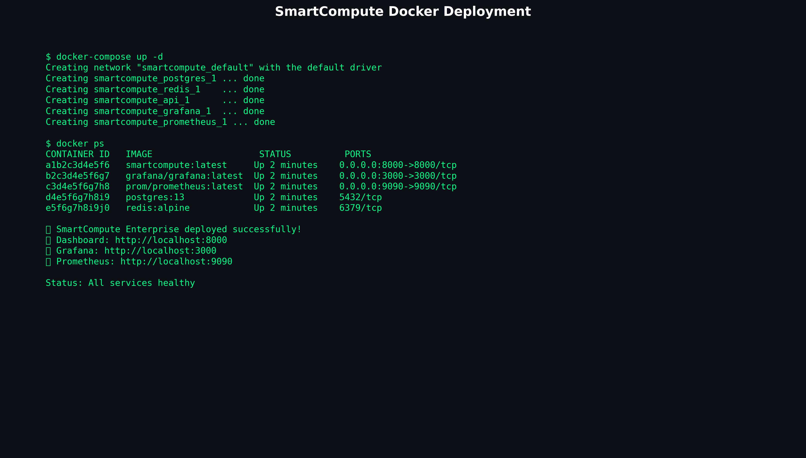

# 🧠 SmartCompute v1.0.0

<table>
<tr>
<td width="20%">

[](https://github.com/cathackr/SmartCompute)

[](https://github.com/cathackr/SmartCompute)

[](https://github.com/cathackr/SmartCompute)


**📱 Repositorios QR:**


</td>
<td width="50%">

### Detecta problemas en redes industriales antes de que fallen los equipos

**Idiomas/Languages:** 🇪🇸 [Español (este documento)](#) | 🇺🇸 [English](README_EN.md)

**🔗 Acceso rápido a repositorios:**
- [🏠 Principal (Público)](https://github.com/cathackr/SmartCompute)
- [🏢 Enterprise (Privado)](https://github.com/cathackr/SmartCompute-Enterprise)
- [🏭 Industrial (Privado)](https://github.com/cathackr/SmartCompute-Industrial)

</td>
<td width="30%">


</td>
</tr>
</table>

---

## 🎯 Overview

SmartCompute es una suite completa de monitoreo inteligente con **3 versiones** para diferentes necesidades:

### 🏠 **SmartCompute Starter** (GRATIS)
Monitoreo básico de rendimiento y detección de anomalías para uso personal y pequeñas empresas.

### 🏢 **SmartCompute Enterprise** ($200-750/año)
Análisis avanzado con IA, APIs empresariales, dashboard personalizable y soporte técnico. 
**📋 Documentación completa disponible tras la compra.**

### 🏭 **SmartCompute Industrial** ($5000/3 años)
**¿Tu red industrial falla sin avisar?** Versión especializada que monitorea protocolos como Modbus, Profinet y OPC UA, detectando conflictos de IP, latencia alta y dispositivos problemáticos. Te avisa qué revisar, pero nunca toca tu configuración automáticamente.
**📋 Documentación técnica completa disponible tras la compra.**

---

SmartCompute Starter ofrece:

- ⚡ **Real-time Threat Detection** with fast response capabilities
- 🧠 **AI-Powered Analytics** for pattern recognition  
- 🔒 **Security Monitoring** with configurable protection mechanisms
- 📊 **Performance Monitoring** with system resource awareness
- 🛡️ **Alert Management** with machine learning enhancement
- 🌍 **Multi-Platform Support** for Windows, macOS, Linux, Android, iOS

## 🚀 Instalación SmartCompute Starter (GRATIS)

### Instalación Básica

```bash
# 1. Clonar el repositorio
git clone https://github.com/cathackr/SmartCompute.git
cd SmartCompute

# 2. Instalar dependencias
pip install -r requirements.txt

# 3. Ejecutar versión gratuita
python main.py --starter

# Dashboard: http://localhost:8000
```

### 📱 Instalación en Dispositivos Móviles

**SmartCompute Starter también funciona en móviles con apps de Python:**

#### Android:
```bash
# 1. Instalar "Pydroid 3" desde Google Play
# 2. Abrir Pydroid 3 y en la terminal ejecutar:
pip install requests numpy pandas
wget https://raw.githubusercontent.com/cathackr/SmartCompute/main/main.py
python main.py --starter --mobile
```

#### Google Colab (📱 iOS, Android, PC):
```python
# 1. Abrir https://colab.research.google.com desde cualquier dispositivo
# 2. Crear nuevo notebook y ejecutar en la primera celda:
!git clone https://github.com/cathackr/SmartCompute.git
%cd SmartCompute

# 3. Instalar dependencias en segunda celda:
!pip install -r requirements.txt

# 4. Ejecutar DEMO INTERACTIVO en tercera celda (RECOMENDADO):
!python examples/synthetic_demo.py
# 📱 Alertas en tiempo real + gráficos animados + optimizado móviles

# 5. OPCIONAL - Servidor web completo:
!python main.py --starter &
# Dashboard web profesional con APIs
```

**✅ Ventajas de Google Colab:**
- 🌐 **Universal**: Funciona en iPhone, Android, tablet, PC
- ⚡ **Sin instalación**: Solo necesitas navegador web  
- 🚀 **GPU gratis**: Aceleración para análisis complejos
- 💾 **Persistente**: Guarda tu configuración en Google Drive

### 📋 Requisitos del Sistema
- **Instalación local**: Python 3.8+ (Linux/Windows/macOS/Android)
- **Google Colab**: Solo navegador web (iOS, Android, PC, tablet)
- **Móviles**: ✅ Android (apps locales) + iOS/Android (Colab web)

## 📸 Ve SmartCompute Starter en Acción

### 📱 SmartCompute Starter en Smartphones

*Monitoreo básico desde Android/iOS - perfecto para freelancers y PyMEs*

**Funciona en tu móvil:**
- 🌐 **Google Colab**: Acceso universal desde cualquier navegador (iOS, Android, PC)
- 📱 **Android**: Pydroid 3 (GRATIS) + QPython 3L (GRATIS) para instalación local
- 🔋 **Bajo consumo web**: Sin impacto en batería (corre en la nube)
- 🚀 **GPU gratuita**: Procesa análisis complejos más rápido que tu PC
- 📱 **Interface táctil**: Optimizado para pantallas móviles

**Opciones de instalación local:**
- 🤖 **Android**: QPython 3L, Termux (terminal completo)
- 🌐 **Navegador**: Google Colab (recomendado para iOS y uso casual)

### 🐳 Docker & Kubernetes Ready

*Instalación completa con un comando - desarrollo y producción*

## 💰 Planes y Precios

### 🏠 **Starter Plan**
**GRATUITO** - Para uso personal y pequeñas empresas
- ✅ Monitoreo básico de rendimiento
- ✅ Detección de anomalías
- ✅ Dashboard web básico
- ❌ APIs limitadas
- ❌ Sin soporte técnico

### 🏢 **Enterprise Plan**
**$200-750/año** - Para empresas medianas y grandes

<table>
<tr>
<td width="70%">

- ✅ Todo de Starter +
- ✅ IA avanzada para análisis predictivo
- ✅ APIs empresariales completas
- ✅ Dashboard personalizable
- ✅ Integración con sistemas existentes
- ✅ Soporte técnico prioritario
- ✅ Reportes personalizados

</td>
<td width="30%" align="center">

**📱 Acceso Rápido**


[🔗 Repositorio Enterprise](https://github.com/cathackr/SmartCompute-Enterprise)

</td>
</tr>
</table>

### 🏭 **Industrial Plan**
**$5000/3 años** - Para redes industriales críticas

<table>
<tr>
<td width="70%">

- ✅ Todo de Enterprise +
- ✅ Monitoreo de protocolos industriales (Modbus, Profinet, OPC UA)
- ✅ Detección de conflictos de red en tiempo real
- ✅ Análisis de dispositivos industriales (PLCs, HMIs)
- ✅ Alertas de seguridad especializadas
- ✅ Consultoría de implementación incluida
- ✅ Certificaciones industriales (ISA/IEC 62443)

</td>
<td width="30%" align="center">

**📱 Acceso Rápido**


[🔗 Repositorio Industrial](https://github.com/cathackr/SmartCompute-Industrial)

</td>
</tr>
</table>

## 🚀 Installation

### Source Installation
```bash
# Clone the repository
git clone https://github.com/cathackr/SmartCompute.git
cd SmartCompute

# Install Python dependencies
pip install -r requirements.txt

# Test with the demo
python3 examples/synthetic_demo.py
```

## 📁 Estructura del Proyecto

<table>
<tr>
<td width="30%" valign="top">

### 📂 Directorio Principal
```
SmartCompute/
├── 📱 app/                    # Backend FastAPI
├── 🎨 assets/                 # Imágenes y recursos
├── 🐳 docker-compose.yml     # Contenedores
├── ⚙️ main.py                # Servidor principal
└── 📋 README.md              # Este archivo
```

**Archivos clave:**
- [`main.py`](main.py) - Punto de entrada
- [`requirements.txt`](requirements.txt) - Dependencias

</td>
<td width="70%" valign="top">

### 🗂️ Navegación Rápida por Carpetas

| **📱 Backend** | **🎨 Assets** | **🧪 Scripts** |
|---------------|---------------|---------------|
| [`app/api/`](app/api/) | [`assets/`](assets/) | [`scripts/`](scripts/) |
| [Health Endpoints](app/api/health_endpoints.py) | [Logo HMI](assets/smartcompute_hmi_logo.png) | [Deploy](scripts/deploy.sh) |
| [Main API](app/api/main.py) | [Dashboard Grafana](assets/grafana_smartcompute_overview.png) | [Monitoring](scripts/setup-monitoring.sh) |
| [Models](app/models/) | [Screenshots](assets/) | [Migration](scripts/migrate_to_postgresql.py) |

| **📋 Docs** | **⚙️ Config** | **🏢 Enterprise** |
|-------------|---------------|-------------------|
| [`docs/`](docs/) | [`docker-compose*.yml`](.) | 🔒 **Acceso Privado** |
| [Technical Documentation](docs/TECHNICAL_DOCUMENTATION.md) | [Production](docker-compose.production.yml) | Disponible tras compra |
| [Quick Start Guide](docs/GUIA_INICIO_RAPIDO.md) | [Development](.env.example) | [🔗 Comprar Enterprise](https://github.com/cathackr/SmartCompute-Enterprise) |

</td>
</tr>
</table>

## 📚 Documentation

- 📖 [Technical Documentation](docs/TECHNICAL_DOCUMENTATION.md)
- 🚀 [Quick Start Guide](docs/GUIA_INICIO_RAPIDO.md)
- 💼 [Enterprise Guide](docs/GUIA_EMPRESARIAL.md)

## 👨‍💻 Creator

**SmartCompute** is created by **Martín Iribarne** - **CEH (Certified Ethical Hacker)**

🛡️ **Senior Cybersecurity & Networks Specialist** with 10+ years of experience in:
- 🔐 **Industrial Network Security** (ISA/IEC 62443 certified)
- 🎯 **Penetration Testing & Vulnerability Assessment**
- 📊 **SIEM Implementation & Security Monitoring**
- ☁️ **Cloud Security** (Azure AZ-900, AWS Cloud Practitioner)
- 🌐 **Network Infrastructure** (CCNA certified)

📍 **Experience**: HCLTech Industrial Network Auditing, Independent Cybersecurity Consulting, Critical Infrastructure Protection

**Professional Certifications:**
- 🏆 CEH (Certified Ethical Hacker)
- 🏆 CCNA (Cisco Certified Network Associate)
- 🏆 Azure Fundamentals AZ-900
- 🏆 AWS Cloud Practitioner
- 🏆 ISA/IEC 62443 Industrial Cybersecurity

- 🔗 **LinkedIn**: [Martín Iribarne CEH](https://www.linkedin.com/in/mart%C3%ADn-iribarne-swtf/)
- 📧 **Contact**: ggwre04p0@mozmail.com
- 📍 **Location**: Mar del Plata, Argentina
- 🐙 **GitHub**: [cathackr](https://github.com/cathackr)

---

## 📞 Support

- **📧 Email**: ggwre04p0@mozmail.com
- **🐙 Issues**: [GitHub Issues](https://github.com/cathackr/SmartCompute/issues)
- **💼 Enterprise**: Professional cybersecurity consulting available

---

© 2024 SmartCompute. All rights reserved.

<div align="center">
  
### 🚀 **¿Listo para evitar el próximo paro de producción?**

**Prueba gratis en 5 minutos:**
```bash
git clone https://github.com/cathackr/SmartCompute.git
cd SmartCompute
python main.py --starter
```

[**⭐ Dale una estrella si te parece útil**](https://github.com/cathackr/SmartCompute) • [**Demo en vivo**](http://127.0.0.1:8000) • [**¿Dudas?**](mailto:ggwre04p0@mozmail.com?subject=SmartCompute%20-%20Consulta)

---

## 💳 Suscripciones y Pagos Directos

### 🏢 **Enterprise Plan - $200-750/año**

**Elige tu modalidad de pago preferida:**

| **Período** | **Precio** | **Descuento** | **Pago Directo** |
|-------------|------------|---------------|------------------|
| **Anual** | $200/año | 65% OFF | [💳 **Pagar $200 USD**](https://cathackr.github.io/SmartCompute/checkout-enterprise-annual.html) |
| **Bianual** | $400/2 años | 65% OFF | [💳 **Pagar $400 USD**](https://cathackr.github.io/SmartCompute/checkout-enterprise-biannual.html) |
| **Premium** | $750/año | Características extra | [💳 **Pagar $750 USD**](https://cathackr.github.io/SmartCompute/checkout-enterprise-premium.html) |

### 🏭 **Industrial Plan - $5000/3 años**

**Incluye implementación y consultoría:**

| **Modalidad** | **Precio Total** | **Incluye** | **Pago Directo** |
|---------------|------------------|-------------|------------------|
| **Pago Completo** | $5000 USD | Todo + 20% descuento adicional | [💳 **Pagar $4000 USD**](https://cathackr.github.io/SmartCompute/checkout-industrial-full.html) |
| **3 Cuotas Anuales** | $1,667 × 3 años | Implementación escalonada | [💳 **Primera Cuota $1667**](https://cathackr.github.io/SmartCompute/checkout-industrial-installments.html) |

### 💰 **Sistema de Suscripción**

**Suscripción mensual recurrente con máxima flexibilidad:**

- 🔄 **Renovación automática**: Se renueva cada mes el mismo día
- ❌ **Cancelación libre**: Puedes cancelar cuando quieras desde el dashboard
- 💸 **Sin penalizaciones**: No hay cargos por cancelación
- ⏰ **Período de gracia**: 15 días para arrepentirse con reembolso completo
- 📅 **Servicio hasta fin de mes**: Si cancelas, mantienes acceso hasta que termine el período pagado

### 💳 **Métodos de Pago Integrados**

- 🇦🇷 **MercadoPago**: Tarjetas, débito automático, transferencias en pesos argentinos
- ₿ **Bitso**: Bitcoin, Ethereum, USDC y otras criptomonedas
- 🔒 **Seguridad**: Todas las transacciones están hasheadas y cifradas
- 🏪 **API segura**: Integración completa con sistemas bancarios certificados

### 📞 **Soporte de Suscripciones**
- **Email**: ggwre04p0@mozmail.com (dudas sobre facturación)
- **LinkedIn**: [Consulta profesional directa](https://www.linkedin.com/in/mart%C3%ADn-iribarne-swtf/)
- **Respuesta**: Todas las consultas se gestionan por correo electrónico

**🔒 Garantía de reembolso de 15 días • Cancela cuando quieras • Sin compromiso de permanencia**

</div>