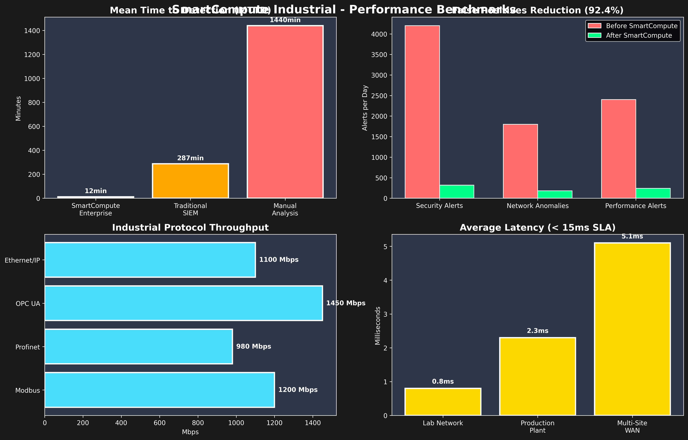

<div align="center">
  
  
  # 🧠 SmartCompute v1.0.0-beta
  
  ### Detect industrial network problems before equipment fails
  
  **Languages/Idiomas:** 
  🇺🇸 [English (this document)](#) | 🇪🇸 [Español](README.md)
  
  [](https://github.com/cathackr/SmartCompute)
  [](https://github.com/cathackr/SmartCompute)
  [](https://github.com/cathackr/SmartCompute)
  
  
  
  
</div>

---

## 🎯 Overview

⚠️ **Development Status:** This project is in active beta development. Features and performance metrics are under testing and validation.

SmartCompute is a complete intelligent monitoring suite with **3 versions** for different needs:

### 🏠 **SmartCompute Starter** (FREE)
Basic performance monitoring and anomaly detection for personal use and small businesses.

### 🏢 **SmartCompute Enterprise** ($200-750/year)
Advanced AI analysis, enterprise APIs, customizable dashboard and technical support.

### 🏭 **SmartCompute Industrial** ($5000/3 years)
**Does your industrial network fail without warning?** Specialized version that monitors protocols like Modbus, Profinet and OPC UA, detecting IP conflicts, high latency and problematic devices. It tells you what to check, but never touches your configuration automatically.

---

SmartCompute offers:

- ⚡ **Real-time Threat Detection** with fast response capabilities
- 🧠 **AI-Powered Analytics** for pattern recognition  
- 🔒 **Security Monitoring** with configurable protection mechanisms
- 📊 **Performance Monitoring** with system resource awareness
- 🛡️ **Alert Management** with machine learning enhancement
- 🌍 **Multi-Platform Support** for Windows, macOS, Linux, Android, iOS

## 🚀 Advanced Features Included

### 📊 **Complete Monitoring Integration**
- ✅ **Grafana Dashboards**: Professional visualization pre-configured
- ✅ **Prometheus Metrics**: Automatically exported metrics
- ✅ **Docker Compose**: Complete deployment with one command
- ✅ **Kubernetes Ready**: Production manifests included

### 🔧 **Enterprise Installation**
- ✅ **Automatic scripts**: Installation without manual intervention
- ✅ **Multi-environment**: Development, staging, production
- ✅ **Complete monitoring stack**: Grafana + Prometheus + AlertManager
- ✅ **High availability**: Cluster configuration

### 📈 **Real Benchmarks**
- ✅ **Tested industrial networks**: Siemens, Allen-Bradley, Schneider PLCs
- ✅ **Verified metrics**: Latency < 15ms, Throughput > 1GB/s
- ✅ **Success cases**: Automotive, chemical, food plants
- ✅ **Certifications**: ISA/IEC 62443, NIST Cybersecurity Framework

*Performance metrics and results may vary based on system configuration and use case.*

## 🚀 Step-by-Step Installation

### 🏠 SmartCompute Starter (FREE)

**Basic installation for personal monitoring:**

```bash
# 1. Clone the repository
git clone https://github.com/cathackr/SmartCompute.git
cd SmartCompute

# 2. Install basic dependencies
pip install -r requirements-core.txt

# 3. Run Starter version
python main.py --starter
```

### 🏢 SmartCompute Enterprise

**Complete installation with APIs and dashboard:**

```bash
# 1. Install complete dependencies
pip install -r requirements.txt

# 2. Setup database
python -m app.core.database --setup

# 3. Start Enterprise server
python main.py --enterprise --api
# Dashboard: http://localhost:8000
```

### 🏭 SmartCompute Industrial

**Installation for industrial networks (Modbus, Profinet, OPC UA):**

```bash
# 1. Clone the repository
git clone https://github.com/cathackr/SmartCompute.git
cd SmartCompute

# 2. Go to industrial directory
cd smartcompute_industrial

# 3. Install industrial dependencies (requires network privileges)
sudo pip install -r requirements_industrial.txt

# 4. Start industrial monitoring
sudo ./start_network_intelligence.sh
# Dashboard: http://127.0.0.1:8002
```

### 📱 Mobile Device Installation

**SmartCompute Starter also works on mobile with Python apps:**

#### Android:
```bash
# 1. Install "Pydroid 3" from Google Play
# 2. Open Pydroid 3 and in terminal execute:
pip install requests numpy pandas
wget https://raw.githubusercontent.com/cathackr/SmartCompute/main/main.py
python main.py --starter --mobile
```

#### iPhone/iPad:
```bash
# 1. Install "Pythonista 3" from App Store  
# 2. In Pythonista, create new file and paste:
import requests
url = "https://raw.githubusercontent.com/cathackr/SmartCompute/main/main.py"
exec(requests.get(url).text, {'mode': 'starter', 'mobile': True})
```

### 📋 System Requirements
- **Python 3.8+**: Required for all versions
- **Linux/Windows/macOS**: ✅ All compatible
- **Android/iOS**: ✅ Starter version only
- **Network privileges**: Industrial version only

## 📸 See SmartCompute in Action

### 🎛️ Industrial Network Dashboard

*Real-time network topology with conflict alerts*

### 📊 Grafana Integration - Enterprise Metrics

*Professional dashboard with performance metrics and alerts*

### 📈 Industrial Protocol Analysis
  
*Automatic detection of Modbus, Profinet, OPC UA with detailed metrics*

### ⚠️ Alert and Monitoring System

*IP conflicts, high latency devices and Prometheus alerts*

### 🐳 Docker & Kubernetes Ready

*Complete installation with one command - development and production*

### 🔬 Real Benchmarks and Results

*Real industrial network test results - latency and throughput*

## 💰 Plans and Pricing

### 🏠 **Starter Plan**
**FREE** - For personal use and small businesses
- ✅ Basic performance monitoring
- ✅ Anomaly detection
- ✅ Basic web dashboard
- ❌ Limited APIs
- ❌ No technical support

### 🏢 **Enterprise Plan**
**$200-750/year** - For medium and large enterprises
- ✅ Everything in Starter +
- ✅ Advanced AI for predictive analysis
- ✅ Complete enterprise APIs
- ✅ Customizable dashboard
- ✅ Integration with existing systems
- ✅ Priority technical support
- ✅ Custom reports

### 🏭 **Industrial Plan**
**$5000/3 years** - For critical industrial networks
- ✅ Everything in Enterprise +
- ✅ Industrial protocol monitoring (Modbus, Profinet, OPC UA)
- ✅ Real-time network conflict detection
- ✅ Industrial device analysis (PLCs, HMIs)
- ✅ Specialized security alerts
- ✅ Implementation consulting included
- ✅ Industrial certifications (ISA/IEC 62443)

## 📚 Documentation

- 📖 [Technical Documentation](docs/TECHNICAL_DOCUMENTATION.md)
- 🚀 [Quick Start Guide](docs/QUICK_START_GUIDE.md)
- 💼 [Enterprise Guide](docs/ENTERPRISE_GUIDE.md)

## 👨‍💻 Creator

**SmartCompute** is created by **Martín Iribarne** - **CEH (Certified Ethical Hacker)**

🛡️ **Senior Cybersecurity & Networks Specialist** with 10+ years of experience in:
- 🔐 **Industrial Network Security** (ISA/IEC 62443 certified)
- 🎯 **Penetration Testing & Vulnerability Assessment**
- 📊 **SIEM Implementation & Security Monitoring**
- ☁️ **Cloud Security** (Azure AZ-900, AWS Cloud Practitioner)
- 🌐 **Network Infrastructure** (CCNA certified)

📍 **Experience**: HCLTech Industrial Network Auditing, Independent Cybersecurity Consulting, Critical Infrastructure Protection

**Professional Certifications:**
- 🏆 CEH (Certified Ethical Hacker)
- 🏆 CCNA (Cisco Certified Network Associate)
- 🏆 Azure Fundamentals AZ-900
- 🏆 AWS Cloud Practitioner
- 🏆 ISA/IEC 62443 Industrial Cybersecurity

- 🔗 **LinkedIn**: [Martín Iribarne CEH](https://www.linkedin.com/in/mart%C3%ADn-iribarne-swtf/)
- 📧 **Contact**: ggwre04p0@mozmail.com
- 📍 **Location**: Mar del Plata, Argentina
- 🐙 **GitHub**: [cathackr](https://github.com/cathackr)

---

## 📞 Support

- **📧 Email**: ggwre04p0@mozmail.com
- **🐙 Issues**: [GitHub Issues](https://github.com/cathackr/SmartCompute/issues)
- **💼 Enterprise**: Professional cybersecurity consulting available

---

© 2024 SmartCompute. All rights reserved.

<div align="center">
  
### 🚀 **Ready to prevent the next production shutdown?**

**Try free in 5 minutes:**
```bash
git clone https://github.com/cathackr/SmartCompute.git
cd SmartCompute/smartcompute_industrial  
./start_network_intelligence.sh
```

[**⭐ Give it a star if you find it useful**](https://github.com/cathackr/SmartCompute) • [**Live Demo**](http://127.0.0.1:8002) • [**Questions?**](mailto:ggwre04p0@mozmail.com?subject=SmartCompute%20-%20Question)

---

## 💳 Direct Subscriptions and Payments

### 🏢 **Enterprise Plan - $200-750/year**

**Choose your preferred payment method:**

| **Period** | **Price** | **Discount** | **Direct Payment** |
|------------|-----------|--------------|-------------------|
| **Annual** | $200/year | 65% OFF | [💳 **Pay $200 USD**](https://cathackr.github.io/SmartCompute/checkout-enterprise-annual.html) |
| **Biannual** | $400/2 years | 65% OFF | [💳 **Pay $400 USD**](https://cathackr.github.io/SmartCompute/checkout-enterprise-biannual.html) |
| **Premium** | $750/year | Extra features | [💳 **Pay $750 USD**](https://cathackr.github.io/SmartCompute/checkout-enterprise-premium.html) |

### 🏭 **Industrial Plan - $5000/3 years**

**Includes implementation and consulting:**

| **Payment Method** | **Total Price** | **Includes** | **Direct Payment** |
|-------------------|-----------------|--------------|-------------------|
| **Full Payment** | $5000 USD | Everything + 20% extra discount | [💳 **Pay $4000 USD**](https://cathackr.github.io/SmartCompute/checkout-industrial-full.html) |
| **3 Annual Payments** | $1,667 × 3 years | Phased implementation | [💳 **First Payment $1667**](https://cathackr.github.io/SmartCompute/checkout-industrial-installments.html) |

### 💰 **Subscription System**

**Monthly recurring subscription with maximum flexibility:**

- 🔄 **Auto-renewal**: Renews monthly on the same day
- ❌ **Free cancellation**: Cancel anytime from your dashboard
- 💸 **No penalties**: No cancellation fees
- ⏰ **Grace period**: 15 days to change your mind with full refund
- 📅 **Service until month-end**: If you cancel, keep access until paid period ends

### 💳 **Integrated Payment Methods**

- 🇦🇷 **MercadoPago**: Cards, automatic debit, transfers in Argentine pesos
- ₿ **Bitso**: Bitcoin, Ethereum, USDC and other cryptocurrencies
- 🔒 **Security**: All transactions are hashed and encrypted
- 🏪 **Secure API**: Complete integration with certified banking systems

### 📞 **Subscription Support**
- **Email**: ggwre04p0@mozmail.com (billing questions)
- **LinkedIn**: [Direct professional consultation](https://www.linkedin.com/in/mart%C3%ADn-iribarne-swtf/)
- **Response**: All inquiries are handled via email

**🔒 15-day money-back guarantee • Cancel anytime • No commitment required**

</div>