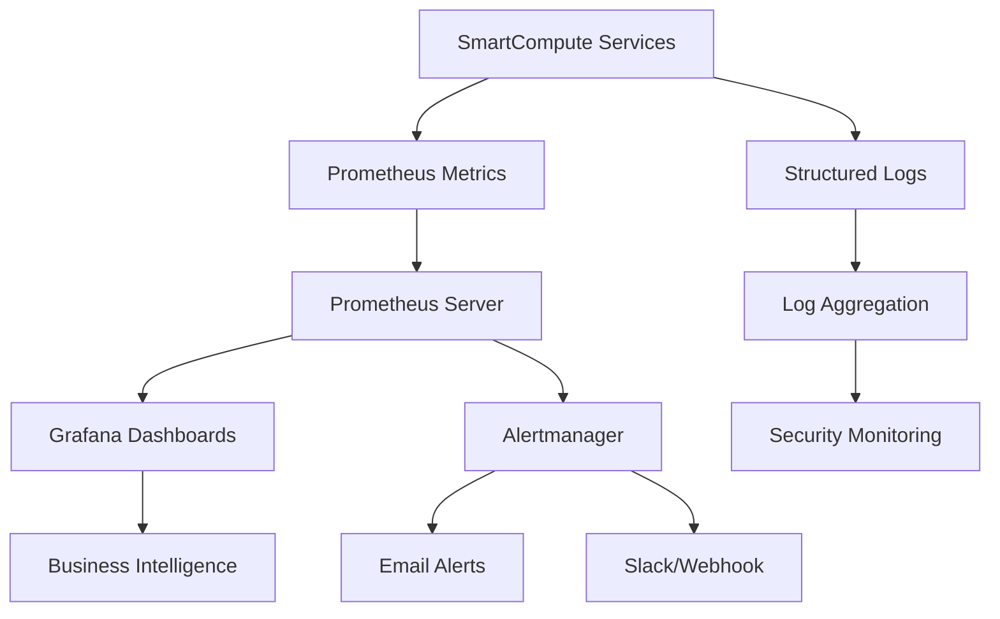

# SmartCompute Observability Guide

## Overview

SmartCompute implements comprehensive observability with three key pillars:

1. **Metrics** - Prometheus metrics for performance and business insights
2. **Logs** - Structured JSON logging with PII filtering and rotation
3. **Alerting** - Intelligent alerting with proper escalation

## Architecture



## Metrics Collection

### Prometheus Metrics

All services expose metrics on `/metrics` endpoint:

- **HTTP Metrics**: Request rates, response times, status codes
- **Business Metrics**: Payments, analysis requests, threat detections
- **Performance Metrics**: Queue sizes, optimization results, accuracy
- **System Metrics**: CPU, memory, database connections
- **Security Metrics**: Authentication failures, threat detection rates

### Key Metrics

| Metric | Type | Description |
|--------|------|-------------|
| `http_requests_total` | Counter | Total HTTP requests by service/endpoint/status |
| `http_request_duration_seconds` | Histogram | Request duration distribution |
| `smartcompute_analysis_requests_total` | Counter | Analysis requests by type and status |
| `smartcompute_threat_detections_total` | Counter | Threat detections by severity |
| `smartcompute_payments_total` | Counter | Payment transactions by currency/status |
| `smartcompute_optimization_speedup` | Histogram | Performance optimization speedup factors |
| `smartcompute_service_status` | Enum | Service health status |

### Usage Example

```python
from services.monitoring.prometheus_metrics import get_metrics

# Get metrics instance for service
metrics = get_metrics("my-service")

# Track analysis performance
metrics.track_analysis("threat_analysis", duration=0.05, status="completed")

# Track threat detection
metrics.track_threat_detection(severity="high", threat_type="malware")

# Track payment
metrics.track_payment(currency="BTC", amount_usd=29.99, status="completed")
```

## Structured Logging

### Features

- **JSON Format**: Machine-readable structured logs
- **PII Filtering**: Automatic masking of sensitive data
- **Log Rotation**: Automatic file rotation (100MB, 5 backups)
- **Contextual Logging**: Request IDs, user IDs (hashed), trace IDs
- **Security Logging**: Special handling for security events

### PII Protection

The logging system automatically detects and masks:

- Email addresses (hashed for correlation)
- IP addresses (hashed for correlation)  
- Phone numbers
- Credit card numbers
- API keys and tokens
- Password fields
- JWT tokens

### Usage Example

```python
from services.monitoring.structured_logging import setup_logging, get_logger

# Setup structured logging for service
setup_logging(
    service_name="my-service",
    log_level="INFO",
    environment="production",
    mask_pii=True
)

# Get contextual logger
logger = get_logger("my-service", request_id="req-123", user_id="user-456")

# Log with context
logger.info("Payment processed", extra={
    "payment_id": "pay_123",
    "amount": 29.99,
    "currency": "USD"
})

# Log security event
logger.warning("Failed login attempt", extra={
    "event_type": "security",
    "source_ip": "192.168.1.100",  # Will be hashed
    "attempts": 3
})
```

### Log Structure

```json
{
  "timestamp": "2025-08-27T10:30:45.123456Z",
  "service": "smartcompute-api",
  "environment": "production",
  "level": "INFO",
  "logger": "smartcompute.api",
  "message": "Payment processed successfully",
  "module": "payment_handler",
  "function": "process_payment",
  "line": 142,
  "request_id": "req-abc123",
  "user_id_hash": "a1b2c3d4e5f6g7h8",
  "extra": {
    "payment_id": "pay_xyz789",
    "amount_usd": 29.99,
    "currency": "BTC",
    "processing_time_ms": 245
  }
}
```

## Dashboards

### Available Dashboards

1. **System Overview** - Service status, request rates, response times
2. **Security Monitoring** - Threat detections, anomaly scores, failed auth
3. **Performance Analytics** - Analysis performance, optimization results
4. **Business Metrics** - Revenue, payments, user engagement

### Key Visualizations

- **Service Health**: Real-time service status indicators
- **Request Rate**: HTTP requests per second by service
- **Error Rate**: Error percentage with alerting thresholds
- **Response Time**: P50, P95, P99 response time percentiles
- **Threat Timeline**: Security events over time
- **Revenue Tracking**: Payment volume and success rates
- **Queue Monitoring**: Analysis queue sizes and processing

## Alerting

### Alert Categories

| Category | Severity | Response Time | Escalation |
|----------|----------|---------------|------------|
| **Critical** | Service Down, Security Breach | Immediate | On-call + Management |
| **Warning** | High Error Rate, Performance | 5-15 minutes | Team Lead |
| **Info** | Business Metrics, Trends | Best effort | Daily digest |

### Key Alerts

#### Service Health
- **ServiceDown**: Service unreachable for >30s
- **HighErrorRate**: Error rate >5% for >2min  
- **VeryHighResponseTime**: P95 latency >10s for >2min

#### Security
- **CriticalThreatDetected**: Critical threat detected (immediate)
- **HighThreatDetectionRate**: >10 high/critical threats in 5min
- **SecurityViolationSpike**: >20 security violations in 5min

#### Performance  
- **AnalysisQueueBackup**: Queue size >100 for >3min
- **DatabaseQueryTimeout**: Query P95 >30s for >3min

#### Business
- **PaymentFailureSpike**: Payment failure rate >20% for >3min
- **RevenueDropAlert**: Revenue 50% below yesterday for >30min

### Alert Routing

```yaml
# Critical alerts - immediate notification
- match:
    severity: 'critical'
  receiver: 'critical-alerts'
  group_wait: 10s
  repeat_interval: 30m

# Security alerts - security team  
- match_re:
    alertname: '.*Threat.*|.*Security.*'
  receiver: 'security-team'
  group_wait: 10s
  repeat_interval: 1h
```

## Setup Instructions

### 1. Start Monitoring Stack

```bash
# Setup monitoring infrastructure
./scripts/setup-monitoring.sh

# Or manually with Docker Compose
cd monitoring
docker-compose -f docker-compose.monitoring.yml up -d
```

### 2. Access Interfaces

- **Grafana**: http://localhost:3000 (admin/admin123)
- **Prometheus**: http://localhost:9090  
- **Alertmanager**: http://localhost:9093

### 3. Configure Services

Add to your service code:

```python
# Enable monitoring
from services.monitoring.prometheus_metrics import get_metrics
from services.monitoring.structured_logging import setup_logging

# Setup logging and metrics
setup_logging(service_name="my-service")
metrics = get_metrics("my-service")

# Add to FastAPI app
app.middleware("http")(prometheus_middleware(metrics))
```

### 4. Environment Variables

```bash
# Logging configuration
LOG_LEVEL=INFO
ENVIRONMENT=production

# Grafana credentials  
GRAFANA_PASSWORD=your_secure_password

# Alert configuration
SMTP_SERVER=localhost:587
ALERT_EMAIL=alerts@smartcompute.local
```

## Monitoring Best Practices

### Metrics
- Use counters for events that only increase
- Use histograms for duration and size measurements
- Use gauges for values that can go up and down
- Label cardinality should be reasonable (<1000 per metric)

### Logging
- Log at appropriate levels (DEBUG < INFO < WARNING < ERROR < CRITICAL)
- Include contextual information (request_id, user_id, etc.)
- Never log sensitive data (passwords, tokens, PII)
- Use structured fields for queryable data

### Alerting
- Alert on symptoms, not causes
- Have runbooks for all alerts
- Use proper severity levels and routing
- Avoid alert fatigue with intelligent grouping

### Dashboard Design
- Design for your audience (business vs technical)
- Use consistent time ranges and colors
- Include context and annotations
- Design for different screen sizes

## Troubleshooting

### Common Issues

**Services not showing metrics**
- Check `/metrics` endpoint is accessible
- Verify Prometheus configuration and targets
- Check service discovery and networking

**High cardinality warnings**
- Review metric labels for excessive values
- Consider using histogram buckets instead of labels
- Aggregate high-cardinality metrics

**Missing logs**
- Check log directory permissions
- Verify log rotation configuration
- Check disk space and file descriptors

**Alerts not firing**
- Verify Prometheus rule evaluation
- Check Alertmanager configuration and routing
- Test notification channels (email, Slack, etc.)

### Maintenance

**Daily Tasks**
- Review alert summary and trends
- Check dashboard health and update
- Monitor resource usage and scaling

**Weekly Tasks**  
- Review and tune alert thresholds
- Update dashboards based on feedback
- Analyze log patterns and optimize retention

**Monthly Tasks**
- Review metrics retention policies
- Update monitoring documentation  
- Conduct observability training

## Security Considerations

- **Network Security**: Monitoring interfaces only on localhost
- **Data Protection**: PII masking and log redaction
- **Access Control**: Role-based dashboard access
- **Audit Logging**: All administrative actions logged
- **Encryption**: TLS for all external communications

## Performance Impact

Monitoring overhead is minimal:
- **Metrics Collection**: <1% CPU, <50MB RAM per service
- **Structured Logging**: <2% CPU, configurable disk usage
- **Dashboard Queries**: Cached results, optimized queries
- **Alert Evaluation**: Occurs every 15s, very lightweight

## Integration Examples

### Custom Metrics
```python
# Business-specific metrics
user_registrations = Counter('user_registrations_total', 'User registrations')
feature_usage = Histogram('feature_usage_seconds', 'Feature usage time')

# Track business events
user_registrations.inc()
feature_usage.observe(session_duration)
```

### Distributed Tracing
```python
# Add trace context to logs
logger = get_logger("my-service", 
    trace_id=request.headers.get('X-Trace-ID'),
    span_id=generate_span_id()
)
```

This observability implementation provides comprehensive monitoring capabilities while maintaining security and performance standards appropriate for production use.