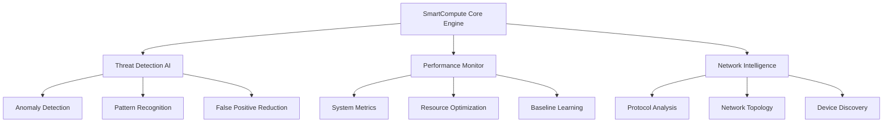

# 🧠 SmartCompute Technical Documentation

<div align="center">
  
  
  **Version 1.0.0** | **Cybersecurity Monitoring Platform**
  
  [🇪🇸 Español](DOCUMENTACION_TECNICA.md) | [🇺🇸 English](#) | [🚀 Quick Start](QUICK_START_GUIDE.md)
</div>

---

## 📋 Table of Contents

- [🎯 Platform Overview](#-platform-overview)
- [🏠 SmartCompute](#-smartcompute)
- [📱 Mobile & Google Colab](#-mobile--google-colab)  
- [💻 Desktop Installation](#-desktop-installation)
- [🔧 Basic API Reference](#-basic-api-reference)
- [🚀 Deployment Options](#-deployment-options)
- [🛠️ Troubleshooting](#️-troubleshooting)

---

## 🎯 Platform Overview

SmartCompute is a cybersecurity monitoring platform with **AI-powered threat detection** and **performance optimization** capabilities.

### 🌟 Core Features

- **🔍 Real-time Monitoring**: CPU, Memory, Network usage
- **🤖 AI Threat Detection**: Common threat patterns  
- **📊 Performance Analytics**: System metrics and optimization
- **📱 Multi-platform Support**: Web, mobile, and Google Colab
- **💾 Local Storage**: SQLite database

### 🏗️ Architecture



---

## 🏠 SmartCompute

**Cybersecurity monitoring for personal use and small businesses**

### ✨ Features Included

- **🔍 Basic Monitoring**: CPU, Memory, Network usage
- **🤖 Simple AI Detection**: Common threat patterns  
- **📊 Web Dashboard**: Real-time metrics visualization
- **📱 Google Colab Support**: Universal mobile access
- **💾 Local Storage**: SQLite database

### 🚀 Quick Installation

#### Option 1: Local Installation
```bash
git clone https://github.com/cathackr/SmartCompute.git
cd SmartCompute
pip install -r requirements.txt
python main.py
```

#### Option 2: Google Colab (Recommended for Mobile)
```python
# Open: https://colab.research.google.com
!git clone https://github.com/cathackr/SmartCompute.git
%cd SmartCompute
!pip install -r requirements.txt
!python examples/colab_interactive_demo.py
```

### 🎯 Use Cases

- **Personal Security**: Home network monitoring
- **Small Business**: Basic threat detection for <10 devices
- **Learning**: Cybersecurity training and education
- **Development**: Testing and proof of concepts

### 📊 Performance Expectations

- **Response Time**: <50ms for basic detections
- **Memory Usage**: ~100MB RAM
- **Storage**: ~50MB disk space
- **Network Impact**: <1% bandwidth usage

---

## 📱 Mobile & Google Colab

**Universal access from any device with a web browser**

### 🌟 Google Colab Advantages

| Benefit | Description |
|---------|-------------|
| **🌐 Universal** | Works on iPhone, Android, tablets, PCs |
| **⚡ Zero Installation** | Just open a web browser |
| **🚀 Free GPU** | Google provides free GPU acceleration |
| **💾 Cloud Storage** | Automatically saves to Google Drive |
| **📊 Rich Visualizations** | Interactive charts and graphs |

### 🎮 Interactive Demo Features

- **Real-time Threat Alerts**: Color-coded severity levels
- **Live Performance Charts**: CPU, memory, network metrics
- **Animated Dashboards**: Mobile-optimized interface
- **Threat Classification**: Automatic categorization
- **Export Capabilities**: JSON reports and visualizations

### 📱 Mobile-Specific Features

```python
# Mobile-optimized display
from IPython.display import display, HTML
display(HTML(mobile_dashboard_html))

# Touch-friendly controls
interactive_widgets = create_mobile_controls()

# Responsive charts
chart = create_responsive_chart(data, mobile=True)
```

### 🔧 Advanced Mobile Usage

For power users who want local mobile installation:

#### Android Options
```bash
# Termux (Advanced users)
pkg install python git
git clone https://github.com/cathackr/SmartCompute.git
cd SmartCompute && python main.py --starter --mobile

# QPython 3L (User-friendly)
# Install QPython 3L from Google Play
# Import SmartCompute project
# Run starter version
```

---

## 💻 Desktop Installation

**Full-featured installation for Windows, macOS, and Linux**

### 🖥️ System Requirements

| Component | Minimum | Recommended |
|-----------|---------|-------------|
| **OS** | Windows 10, macOS 11, Ubuntu 20.04 | Latest versions |
| **Python** | 3.8+ | 3.11+ |
| **RAM** | 4GB | 8GB+ |
| **Storage** | 1GB | 5GB+ |
| **Network** | 100 Mbps | 1 Gbps+ |

### 🐧 Linux Installation

```bash
# Ubuntu/Debian
sudo apt update && sudo apt install python3 python3-pip git
git clone https://github.com/cathackr/SmartCompute.git
cd SmartCompute
pip3 install -r requirements.txt
python3 main.py

# CentOS/RHEL
sudo yum install python3 python3-pip git
# Follow same steps as Ubuntu

# Arch Linux
sudo pacman -S python python-pip git
# Follow same steps as Ubuntu
```

### 🪟 Windows Installation

```powershell
# Using Windows Package Manager
winget install Python.Python.3.11
winget install Git.Git

# Clone and setup
git clone https://github.com/cathackr/SmartCompute.git
cd SmartCompute
pip install -r requirements.txt
python main.py
```

### 🍎 macOS Installation

```bash
# Using Homebrew
brew install python git
git clone https://github.com/cathackr/SmartCompute.git
cd SmartCompute
pip3 install -r requirements.txt
python3 main.py
```

### 🐳 Docker Installation

```bash
# Quick start with Docker
docker run -p 8000:8000 smartcompute/core:latest

# Or build from source
git clone https://github.com/cathackr/SmartCompute.git
cd SmartCompute
docker-compose up -d
```

### ⚙️ Configuration

```yaml
# config.yaml
smartcompute:
  version: "core"
  database: "sqlite:///smartcompute.db"
  monitoring:
    interval: 5
    metrics: ["cpu", "memory", "network"]
  security:
    threat_threshold: 0.7
    enable_ai: true
  dashboard:
    port: 8000
    theme: "dark"
```


---

## 🔧 Basic API Reference

### 🌐 RESTful API Endpoints

#### Authentication
```http
POST /api/v1/auth/login
Content-Type: application/json

{
  "username": "admin",
  "password": "secure_password"
}

Response: {
  "access_token": "eyJ0eXAiOiJKV1QiLCJhbGciOiJIUzI1NiJ9...",
  "token_type": "bearer",
  "expires_in": 3600
}
```

#### Monitoring Endpoints
```http
# Get system status
GET /api/v1/monitoring/status
Authorization: Bearer {token}

# Get threat alerts
GET /api/v1/security/alerts?severity=high&limit=50

# Get performance metrics
GET /api/v1/metrics/performance?timeframe=1h
```

#### Configuration
```http
# Update monitoring configuration
PUT /api/v1/config/monitoring
Content-Type: application/json

{
  "interval": 10,
  "metrics": ["cpu", "memory", "network", "disk"],
  "ai_enabled": true,
  "threat_threshold": 0.8
}
```

### 🐍 Python SDK

```python
from smartcompute_sdk import SmartComputeClient

# Initialize client
client = SmartComputeClient(
    base_url="https://your-smartcompute.example.com",
    api_key="your-api-key"
)

# Get real-time metrics
metrics = client.monitoring.get_realtime_metrics()
print(f"CPU Usage: {metrics['cpu_percent']}%")

# Query threat alerts
alerts = client.security.get_alerts(
    severity=["high", "critical"],
    timeframe="24h"
)

for alert in alerts:
    print(f"Threat: {alert['type']} - Score: {alert['score']}")

# Get device information
devices = client.monitoring.get_devices()
for device in devices:
    print(f"Device: {device['ip']} - Status: {device['status']}")
```

---

## 🚀 Deployment Options

### ☁️ Cloud Deployment

#### AWS Deployment
```bash
# Using AWS CDK
npm install -g aws-cdk
cdk init smartcompute --language=python
cdk deploy SmartComputeStack

# Or using CloudFormation
aws cloudformation create-stack \
    --stack-name smartcompute \
    --template-body file://aws-template.yaml
```

#### Azure Deployment
```bash
# Using Azure CLI
az group create --name smartcompute-rg --location eastus
az container create \
    --resource-group smartcompute-rg \
    --name smartcompute \
    --image smartcompute/core:latest \
    --ports 8000
```

#### Google Cloud Deployment
```bash
# Using Google Cloud Run
gcloud run deploy smartcompute \
    --image gcr.io/your-project/smartcompute \
    --platform managed \
    --allow-unauthenticated
```

### 🐳 Kubernetes Deployment

```yaml
# kubernetes/smartcompute-deployment.yaml
apiVersion: apps/v1
kind: Deployment
metadata:
  name: smartcompute
spec:
  replicas: 3
  selector:
    matchLabels:
      app: smartcompute
  template:
    metadata:
      labels:
        app: smartcompute
    spec:
      containers:
      - name: smartcompute
        image: smartcompute/core:latest
        ports:
        - containerPort: 8000
        env:
        - name: DATABASE_URL
          valueFrom:
            secretKeyRef:
              name: smartcompute-secrets
              key: database-url
---
apiVersion: v1
kind: Service
metadata:
  name: smartcompute-service
spec:
  selector:
    app: smartcompute
  ports:
  - port: 80
    targetPort: 8000
  type: LoadBalancer
```

### 🏢 On-Premises Deployment

```bash
# Single node deployment
./scripts/deploy-single.sh --database sqlite --storage local

# Multi-node deployment
./scripts/deploy-ha.sh --nodes 2 --database sqlite --storage local
```

---

## 🛠️ Troubleshooting

### 🚨 Common Issues

#### Installation Problems
```bash
# Python version issues
python --version  # Should be 3.8+
pip install --upgrade pip

# Permission errors
sudo chown -R $USER:$USER ~/.local/
pip install --user -r requirements.txt

# Network connectivity
ping github.com
curl -I https://pypi.org
```

#### Performance Issues
```bash
# Check system resources
htop
df -h
free -m

# Monitor SmartCompute processes
ps aux | grep smartcompute
netstat -tulpn | grep 8000
```

#### Database Issues
```bash
# Reset database
rm smartcompute.db
python -m app.core.database --setup

# Backup database
cp smartcompute.db smartcompute_backup_$(date +%Y%m%d).db
```

### 📞 Support Channels

| Issue Type | Support Channel | Response Time |
|------------|-----------------|---------------|
| **General** | GitHub Issues | Community-driven |
| **Bug Reports** | GitHub Issues | Community-driven |
| **Feature Requests** | GitHub Discussions | Community-driven |

### 📋 Debug Mode

```bash
# Enable debug logging
export SMARTCOMPUTE_DEBUG=true
export SMARTCOMPUTE_LOG_LEVEL=debug
python main.py --debug --verbose

# Collect diagnostic information
python -m smartcompute.diagnostics --collect-all
# Generates: smartcompute_diagnostics_YYYYMMDD.zip
```

---

## 📝 Changelog & Updates

### Version 1.0.0 (Current)
- ✅ Google Colab integration
- ✅ Mobile-optimized interface
- ✅ Basic threat detection
- ✅ Performance monitoring
- ✅ Multi-platform deployment

### Upcoming Features
- 🔄 Real-time dashboard streaming
- 🔄 Enhanced ML models
- 🔄 Mobile app (native iOS/Android)
- 🔄 Additional integrations

---

<div align="center">

**🎯 Ready to secure your infrastructure?**

[🚀 Quick Start](QUICK_START_GUIDE.md) | [📧 Contact Support](mailto:ggwre04p0@mozmail.com)

---

© 2024 SmartCompute. Cybersecurity monitoring platform.

</div>